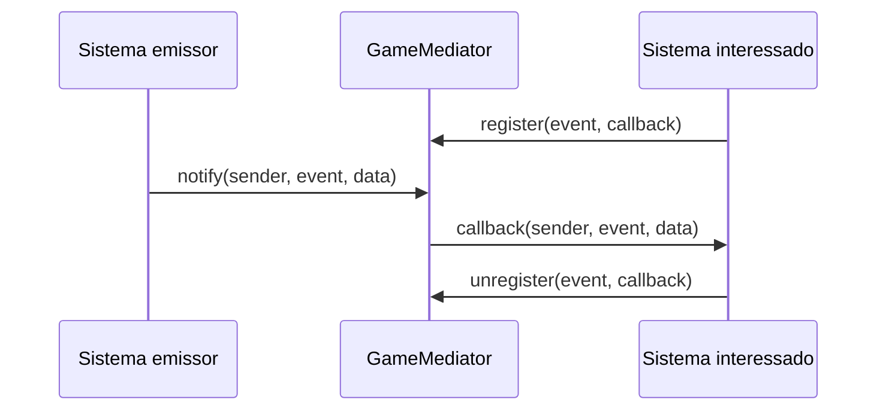

# GOF Comportamental - Mediator

## Introducao

O padrao Mediator centraliza a comunicacao entre objetos para reduzir acoplamento direto. Em vez de um sistema chamar outro sistema diretamente, ele publica um evento em um mediador, que repassa a informacao para todos os interessados registrados.

No contexto do jogo, o `GameMediator` atua como coordenador de comunicacao entre sistemas como `Player`, `Enemy`, `HUD`, `PauseMenu`, `RoomValidator` e `GameManager`.

## Motivacao

Antes desta implementacao, parte da comunicacao entre sistemas dependia de chamadas diretas ao `SignalBus` ou de conexoes diretas em cenas. Isso funcionava como um mediador informal, mas nao deixava explicito:

- quem publica eventos;
- quem escuta eventos;
- como registrar e remover ouvintes;
- como transportar dados de forma padronizada.

A task #17 solicitou uma extensao tipada desse fluxo, com `notify`, `register` e `unregister`, alem da migracao de pelo menos 3 comunicacoes existentes.

## Implementacao

O mediador foi implementado no arquivo:

```text
jogo/scripts/autoloads/game_mediator.gd
```

Ele foi registrado como autoload em:

```text
jogo/project.godot
```

Interface principal:

```gdscript
func notify(sender: Object, event: StringName, data: Dictionary = {}) -> void
func register(event: StringName, callback: Callable) -> void
func unregister(event: StringName, callback: Callable) -> void
```

Cada handler registrado recebe:

```gdscript
sender: Object
event: StringName
data: Dictionary
```

Essa assinatura padroniza o fluxo de eventos e permite que diferentes sistemas reajam ao mesmo evento sem conhecerem diretamente a origem ou outros ouvintes.

## Estrutura Do Mediator

O `GameMediator` mantem um dicionario interno de handlers:

```gdscript
var _handlers: Dictionary = {}
```

Cada chave do dicionario e um evento, e cada valor e uma lista de callbacks interessados nesse evento. Isso permite multiplos handlers por evento.

Fluxo geral:



## Eventos Criados

Foram definidos eventos tipados para as principais comunicacoes do jogo:

| Evento | Responsabilidade |
| --- | --- |
| `EVENT_PLAYER_HEALTH_CHANGED` | Notifica alteracao de vida do jogador |
| `EVENT_PLAYER_DIED` | Notifica morte do jogador |
| `EVENT_ENEMY_DIED` | Notifica morte de inimigo |
| `EVENT_ROOM_CLEARED` | Notifica sala concluida |
| `EVENT_RUN_STARTED` | Notifica inicio de run |
| `EVENT_RUN_ENDED` | Notifica fim de run |
| `EVENT_GAME_PAUSED` | Notifica pause/despause |
| `EVENT_SCORE_CHANGED` | Notifica alteracao de pontuacao |

## Comunicacoes Migradas

### Player Para HUD

Arquivo:

```text
jogo/scripts/player/player.gd
```

O `Player` deixou de publicar diretamente no `SignalBus` para alteracoes de vida e passou a notificar o `GameMediator`.

Arquivo:

```text
jogo/scripts/ui/hud.gd
```

O `HUD` registra um handler no `_ready()` e remove esse handler no `_exit_tree()`:

```gdscript
GameMediator.register(GameMediator.EVENT_PLAYER_HEALTH_CHANGED, _on_mediator_player_health_changed)
GameMediator.unregister(GameMediator.EVENT_PLAYER_HEALTH_CHANGED, _on_mediator_player_health_changed)
```

Isso evidencia o uso de `register` e `unregister` em um sistema de interface.

### GameManager Para PauseMenu

Arquivo:

```text
jogo/scripts/autoloads/game_manager.gd
```

O `GameManager` publica o estado de pause usando:

```gdscript
GameMediator.notify(self, GameMediator.EVENT_GAME_PAUSED, {"is_paused": is_paused})
```

Arquivo:

```text
jogo/scripts/ui/pause_menu.gd
```

O `PauseMenu` escuta o evento de pause pelo mediator e atualiza sua visibilidade sem depender diretamente do emissor.

### Enemy Para RoomValidator

Arquivo:

```text
jogo/scripts/enemies/enemy_base.gd
```

Ao morrer, o inimigo publica:

```gdscript
GameMediator.notify(self, GameMediator.EVENT_ENEMY_DIED, {"enemy": self})
```

Arquivo:

```text
jogo/scripts/world/room_validator.gd
```

O `RoomValidator` escuta `EVENT_ENEMY_DIED` e valida se a sala foi concluida. Quando todos os inimigos foram derrotados, ele publica `EVENT_ROOM_CLEARED`.

### Remocao De Conexao Direta

Arquivo:

```text
jogo/scenes/world/test_room.tscn
```

A conexao direta `Player.health_changed -> HUD.on_player_health_changed` foi removida. Essa comunicacao agora ocorre pelo `GameMediator`.

## Compatibilidade Com SignalBus

O `SignalBus` foi mantido para preservar compatibilidade com sistemas ainda existentes. Para isso, o `GameMediator` registra uma ponte interna que repassa eventos principais para os sinais antigos.

Exemplo:

```gdscript
func _emit_player_health_changed(_sender: Object, _event: StringName, data: Dictionary) -> void:
	SignalBus.player_health_changed.emit(data.get("new_health", 0), data.get("max_health", 0))
```

Essa decisao permite migrar o projeto gradualmente sem quebrar sistemas que ainda dependem de sinais.

## Teste De Unregister

Para evidenciar que `unregister` remove handlers corretamente, foi adicionado um teste de debug:

```gdscript
func debug_test_unregister() -> bool
```

Esse teste registra um callback temporario, dispara o evento, remove o callback, dispara novamente e verifica se o callback foi chamado apenas uma vez.

O teste roda em builds de debug:

```gdscript
if OS.is_debug_build():
	assert(debug_test_unregister(), "GameMediator.unregister nao removeu o handler.")
```

## Como Testar No Godot

1. Abrir o projeto pelo arquivo:

```text
jogo/project.godot
```

2. Rodar a cena principal.

3. Clicar em `Iniciar`.

4. Verificar se o jogo abre sem erros no Output.

5. Testar:

- movimento com WASD ou setas;
- dash com espaco;
- pause/despause com `Esc`;
- botao `Continuar` no pause menu.

Se o pause menu aparece e desaparece corretamente, o fluxo `GameManager -> GameMediator -> PauseMenu` esta funcionando.

## Arquivos Alterados

| Arquivo | Papel na implementacao |
| --- | --- |
| `jogo/scripts/autoloads/game_mediator.gd` | Implementa o Mediator formal |
| `jogo/project.godot` | Registra o `GameMediator` como autoload |
| `jogo/scripts/autoloads/game_manager.gd` | Publica eventos de run, pause e score |
| `jogo/scripts/player/player.gd` | Publica eventos de vida e morte |
| `jogo/scripts/enemies/enemy_base.gd` | Publica evento de morte de inimigo |
| `jogo/scripts/ui/hud.gd` | Escuta evento de vida |
| `jogo/scripts/ui/pause_menu.gd` | Escuta evento de pause |
| `jogo/scripts/world/room_validator.gd` | Escuta morte de inimigo e publica sala concluida |
| `jogo/scenes/world/test_room.tscn` | Remove conexao direta Player-HUD |

## Conclusao

A implementacao atende a task #17 ao criar um mediator formal com `notify`, `register` e `unregister`, suporte a multiplos handlers, dados tipados por evento e migracao de mais de tres comunicacoes do `SignalBus` para o novo fluxo centralizado.
